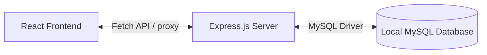

# 💼 Financely — Premium React Finance & Budget Dashboard

> Financely is a beautiful, highly interactive, and responsive personal finance and budget tracker web application built using **React, Vite, CSS3 variables, and Chart.js**.
>
> It features real-time state calculation, visual charts, budget indicators, savings goals animations, and customizable theme settings.

---

## ✨ Features

- **🌐 Theme Switcher**: Instantly switch between 3 premium custom styles:
  - **Slate Dark**: Sleek grey slate cyber-dark mode.
  - **Cyberpunk**: Glowing purple and hot-pink aesthetic.
  - **Emerald Minimalist**: Sophisticated deep forest-green theme.
- **📊 Interactive Allocation Doughnut Chart**: Interactive doughnut chart representing your expenses distribution using **Chart.js**. Updates dynamically as you add or remove transactions.
- **💰 Savings Goal Progress Ring**: Animated circular SVG progress tracker mapping your savings pool status.
- **➕ Quick Alocation ("Tabung")**: Instantly transfer money from your active cash balance to the savings pool with automatic recalculations.
- **📋 Real-time Transaction Ledger**: Add and delete transactions with dynamic instant updates to all summary stats (Balance, Expenses, Income).

---

## 🛠️ Tech Stack

| Component | Technology |
|---|---|
| Framework | React (Vite) |
| Styling | CSS3 (Variable variables, Keyframe animations) |
| Icons | Bootstrap Icons |
| Graphs | Chart.js |

---

## 🚀 Running Locally

1. Clone this repository:
   ```bash
   git clone https://github.com/anYoneo/finance-dashboard.git
   cd finance-dashboard
   ```

2. Install dependencies:
   ```bash
   npm install
   ```

3. Run in development mode:
   ```bash
   npm run dev
   ```
   Open `http://localhost:5173` in your web browser.

4. Build for production:
   ```bash
   npm run build
   ```

---

## 🗄️ Local Database Integration Guide

Secara bawaan, dasbor ini menyimpan data transaksi menggunakan `localStorage` di browser Anda. Jika Anda ingin menghubungkannya dengan database lokal (seperti **MySQL** atau **PostgreSQL**), ikuti panduan arsitektur client-server di bawah ini.

### 📐 Arsitektur Sistem



---

### 1. Buat Skema Database (MySQL)

Buka terminal MySQL Anda dan jalankan perintah berikut untuk membuat database dan tabel-tabel yang diperlukan:

```sql
CREATE DATABASE db_financely;
USE db_financely;

-- Tabel Transaksi
CREATE TABLE transactions (
    id INT AUTO_INCREMENT PRIMARY KEY,
    name VARCHAR(150) NOT NULL,
    amount DECIMAL(15, 2) NOT NULL,
    type ENUM('income', 'expense') NOT NULL,
    category VARCHAR(50) NOT NULL,
    date DATE NOT NULL,
    created_at TIMESTAMP DEFAULT CURRENT_TIMESTAMP
);

-- Tabel Sasaran Tabungan (Single Row Configuration)
CREATE TABLE savings_goal (
    id INT PRIMARY KEY DEFAULT 1,
    target DECIMAL(15, 2) NOT NULL DEFAULT 20000000.00,
    current DECIMAL(15, 2) NOT NULL DEFAULT 7500000.00,
    updated_at TIMESTAMP DEFAULT CURRENT_TIMESTAMP ON UPDATE CURRENT_TIMESTAMP
);

-- Masukkan data awal sasaran tabungan
INSERT INTO savings_goal (id, target, current) VALUES (1, 20000000.00, 7500000.00);
```

---

### 2. Buat Backend API Server Sederhana (Express.js)

Buat folder baru bernama `backend/` sejajar dengan folder proyek ini, lalu jalankan langkah berikut:

```bash
mkdir backend
cd backend
npm init -y
npm install express mysql2 cors dotenv
```

Buat file bernama **`server.js`** di dalam folder `backend/` dan isi dengan kode berikut:

```javascript
const express = require('express');
const mysql = require('mysql2');
const cors = require('cors');
require('dotenv').config();

const app = express();
app.use(cors());
app.use(express.json());

// Hubungkan ke Database Local
const db = mysql.createConnection({
    host: 'localhost',
    user: 'root',          // Ganti dengan username MySQL Anda
    password: 'password',  // Ganti dengan password MySQL Anda
    database: 'db_financely'
});

db.connect(err => {
    if (err) throw err;
    console.log('Terhubung ke database MySQL Local!');
});

// Endpoint untuk mengambil semua transaksi
app.get('/api/transactions', (req, res) => {
    db.query('SELECT * FROM transactions ORDER BY date DESC, id DESC', (err, results) => {
        if (err) return res.status(500).json(err);
        res.json(results);
    });
});

// Endpoint untuk menambah transaksi baru
app.post('/api/transactions', (req, res) => {
    const { name, amount, type, category, date } = req.body;
    const query = 'INSERT INTO transactions (name, amount, type, category, date) VALUES (?, ?, ?, ?, ?)';
    db.query(query, [name, amount, type, category, date], (err, result) => {
        if (err) return res.status(500).json(err);
        res.json({ id: result.insertId, name, amount, type, category, date });
    });
});

// Endpoint untuk menghapus transaksi
app.delete('/api/transactions/:id', (req, res) => {
    db.query('DELETE FROM transactions WHERE id = ?', [req.params.id], (err, result) => {
        if (err) return res.status(500).json(err);
        res.json({ success: true });
    });
});

// Endpoint untuk mengambil target tabungan
app.get('/api/savings', (req, res) => {
    db.query('SELECT * FROM savings_goal WHERE id = 1', (err, results) => {
        if (err) return res.status(500).json(err);
        res.json(results[0]);
    });
});

// Endpoint untuk menambah saldo tabungan
app.post('/api/savings/allocate', (req, res) => {
    const { amount } = req.body;
    db.query('UPDATE savings_goal SET current = LEAST(current + ?, target) WHERE id = 1', [amount], (err, result) => {
        if (err) return res.status(500).json(err);
        res.json({ success: true });
    });
});

app.listen(3000, () => console.log('Server API berjalan di http://localhost:3000'));
```

Jalankan backend server:
```bash
node server.js
```

---

### 3. Hubungkan React Frontend (Ubah App.jsx)

Buka berkas `src/App.jsx` pada React Anda, dan gantikan penggunaan state awal yang bersumber dari `localStorage` menjadi fungsi `fetch` HTTP API:

```javascript
// Gantikan state inisial transactions & savings
const [transactions, setTransactions] = useState([]);
const [savingsGoal, setSavingsGoal] = useState({ target: 20000000, current: 0 });

// 1. Ambil data dari Database saat aplikasi pertama kali dimuat
useEffect(() => {
  // Ambil transaksi
  fetch('/api/transactions')
    .then(res => res.json())
    .then(data => setTransactions(data))
    .catch(err => console.error("Gagal memuat transaksi:", err));

  // Ambil target tabungan
  fetch('/api/savings')
    .then(res => res.json())
    .then(data => setSavingsGoal(data))
    .catch(err => console.error("Gagal memuat sasaran tabungan:", err));
}, []);

// 2. Hubungkan fungsi handleFormSubmit ke API Endpoint POST
const handleFormSubmit = (e) => {
  e.preventDefault();
  const newTx = {
    name: form.name,
    amount: parseFloat(form.amount),
    type: form.type,
    category: form.type === 'income' ? 'Gaji' : form.category,
    date: new Date().toISOString().split('T')[0]
  };

  fetch('/api/transactions', {
    method: 'POST',
    headers: { 'Content-Type': 'application/json' },
    body: JSON.stringify(newTx)
  })
  .then(res => res.json())
  .then(savedTx => {
    setTransactions(prev => [savedTx, ...prev]);
    setForm({ name: '', amount: '', type: 'expense', category: 'Belanja' });
  });
};

// 3. Hubungkan fungsi submitSavings ke API Update Tabungan
const submitSavings = (e) => {
  e.preventDefault();
  const amount = parseInt(modalAmount, 10);

  fetch('/api/savings/allocate', {
    method: 'POST',
    headers: { 'Content-Type': 'application/json' },
    body: JSON.stringify({ amount })
  })
  .then(res => res.json())
  .then(() => {
    setSavingsGoal(prev => ({
      ...prev,
      current: Math.min(prev.current + amount, prev.target)
    }));
    setShowSuccess(true);
    setTimeout(() => {
      setShowSuccess(false);
      setShowModal(false);
    }, 1500);
  });
};

// 4. Hubungkan fungsi handleDeleteTransaction ke API DELETE
const handleDeleteTransaction = (id) => {
  fetch(`/api/transactions/${id}`, { method: 'DELETE' })
    .then(() => {
      setTransactions(prev => prev.filter(t => t.id !== id));
    });
};
```

---

### 4. Konfigurasi Vite Proxy (Ganti `vite.config.js`)

Untuk menghindari masalah keamanan CORS di browser lokal Anda saat melakukan pemanggilan API, konfigurasikan *reverse proxy* di berkas **`vite.config.js`** Anda:

```javascript
import { defineConfig } from 'vite';
import react from '@vitejs/plugin-react';

export default defineConfig({
  plugins: [react()],
  server: {
    proxy: {
      '/api': {
        target: 'http://localhost:3000',
        changeOrigin: true,
        secure: false,
      }
    }
  }
});
```
