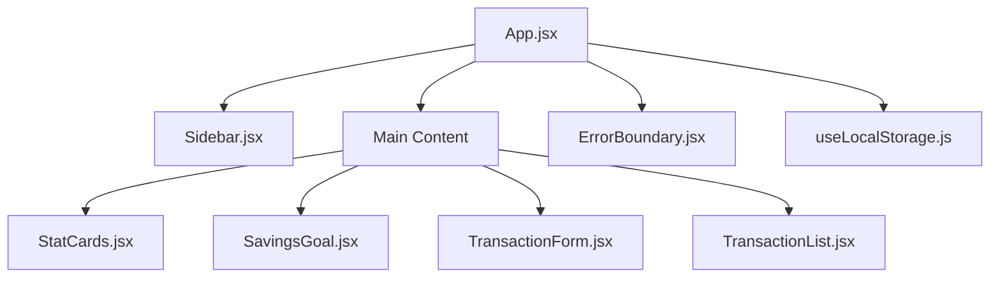

# 💼 Financely — Premium React Finance & Budget Dashboard

> Financely is a beautiful, highly interactive, and responsive personal finance and budget tracker web application built using **React, Vite, CSS3 variables, and Chart.js**.
>
> It features real-time state calculation, visual charts, budget indicators, savings goals animations, and customizable theme settings.

---

## ✨ Features

- **🌐 Theme Switcher**: Instantly switch between 3 premium custom styles:
  - **Slate Dark**: Sleek grey slate cyber-dark mode.
  - **Cyberpunk**: Glowing purple and hot-pink aesthetic.
  - **Emerald Minimalist**: Sophisticated deep forest-green theme.
- **📊 Interactive Allocation Doughnut Chart**: Interactive doughnut chart representing your expenses distribution using **Chart.js**. Updates dynamically as you add or remove transactions.
- **💰 Savings Goal Progress Ring**: Animated circular SVG progress tracker mapping your savings pool status.
- **➕ Quick Alocation ("Tabung")**: Instantly transfer money from your active cash balance to the savings pool with automatic recalculations.
- **📋 Real-time Transaction Ledger**: Add and delete transactions with dynamic instant updates to all summary stats (Balance, Expenses, Income).

---

## 🛠️ Tech Stack

| Component | Technology |
|---|---|
| Framework | React (Vite) |
| Styling | CSS3 (Variable variables, Keyframe animations) |
| Icons | Bootstrap Icons |
| Graphs | Chart.js |

---

## 🚀 Running Locally

1. Clone this repository:
   ```bash
   git clone https://github.com/anYoneo/finance-dashboard.git
   cd finance-dashboard
   ```

2. Install dependencies:
   ```bash
   npm install
   ```

3. Run in development mode:
   ```bash
   npm run dev
   ```
   Open `http://localhost:5173` in your web browser.

4. Build for production:
   ```bash
   npm run build
   ```

---

## 🏗️ Project Architecture

The application has been refactored from a single monolithic file into a scalable component-based architecture.

### Component Tree



---

## 🧪 Testing

*(Placeholder for future tests)*

Currently, manual testing is performed. Automated tests (Jest/React Testing Library) will be implemented in future iterations.

---

## 🐳 Docker Support

You can run the entire application stack using Docker Compose.

```bash
docker-compose up -d --build
```

Refer to the `docker-compose.yml` and `Dockerfile` for configuration details.